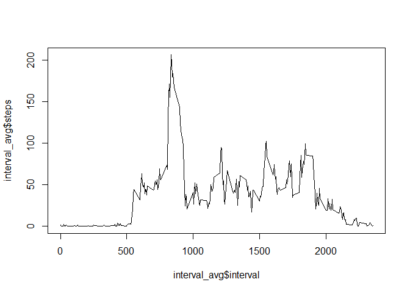
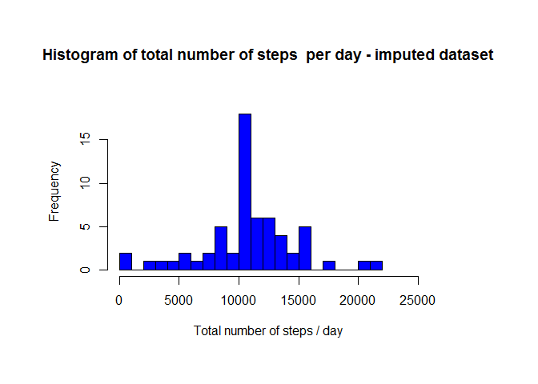
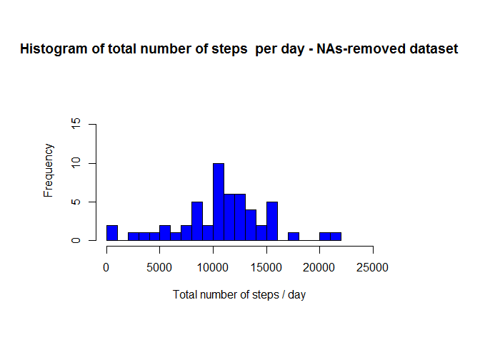
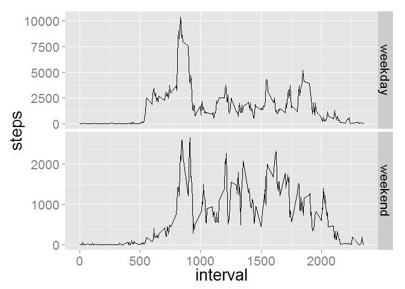

# Reproducible Research: Peer Assessment 1

### Loading and preprocessing the data

**In this part of the assignment, we simply need to move to the folder containing the data for the activity of the subject, read the data and remove those data items that are not complete using the _complete.cases_ function.**


```r
setwd("c:/Coursera/00_Data_Science_Specialization/Reproducible_Research/Assessment1")
activity <- read.csv("activity.csv")
orig_activity <- activity
activity <- activity[complete.cases(activity),]
```

### What is mean total number of steps taken per day?
**For this part of the assignment, you can ignore the missing values in the dataset.**

* Make a histogram of the total number of steps taken each day

```r
## use the aggregate() function to determine the number of steps on each date
total_steps <- aggregate(steps ~ date, data = activity, sum)
## adjust the plotting area and hist function settings 
par(mar = c(7,7,7,7))
hist(total_steps$steps, breaks = 30, col = "blue", xlab = "Total number of steps / day", ylab = "Frequency", xlim = c(0, 25000), ylim = c(0, 18), cex = 2)
```

 

* Calculate and report the mean and median total number of steps taken per day


```r
mean_steps <-format(mean(total_steps$steps), scientific = FALSE)
median_steps <- format(median(total_steps$steps), scientific = FALSE)
```

The **_mean_** and **_median_** numbers of steps taken per day is 10766 and 10765, respectively.

### What is the average daily activity pattern?
**The first part to answering this question is to make a time series plot (i.e. type = "l") of the 5-minute interval (x-axis)  and the average number of steps taken, averaged across all days (y-axis).**


```r
## obtain the desired information by aggregating steps data points by their intervals
interval_avg <- aggregate(steps ~ interval, data = activity, mean)
## plot the resulting data frame
plot(interval_avg$interval, interval_avg$steps, type = "l")
```

 

**The second part is to determine which 5-minute interval contains, on average across all the days in the dataset, the maximum number of steps.**


```r
max_steps <- interval_avg[which.max(interval_avg$steps),]
max_steps$interval
```

```
## [1] 835
```
           
### Imputing missing values

**To perform this task we first need to calculate and report the total number of missing values in the dataset (i.e. the total number of rows with NAs). This has been done using the following code:**


```r
## The difference between the original data and the cleaned data gives the number of NAs
NA_count = length(orig_activity$steps) - length(activity$steps)
```

The count of missing values in the current dataset is 2304.

**The strategy chosen for imputation was to substitute all NAs with the averages for the corresponding intervals as calculated in one of the previous steps**

**The next step in the process is to create a new dataset that is equal to the original dataset but with the missing data filled in.**


```r
## copy the original data to a new variable 
impute_activity = orig_activity

## the vectorized strategy for subsets of the dataset for imputation and the dataset of averages did not work
## Below is the iterative for-loop strategy for achieving the strategy mentioned above

for(i in 1:length(impute_activity$steps)){
  if(is.na(impute_activity[i,]$steps)){
    interval = impute_activity[i,]$interval
    impute_activity[i,]$steps = interval_avg[interval_avg$interval == interval,]$steps
  }  
}
```

**In the following, we show the extent to which imputation affects the distribution of data using histograms of the total number of steps taken each day for the dataset with NAs removed and the imputed dataset.**


```r
## Make a histogram of the total number of steps taken each day based on the imputed dataset
total_steps_imp <- aggregate(steps ~ date, data = impute_activity, sum)

## output of the plotting results to an SVG file
## the figures were manually exported to SVG files 
par(mar = c(7,7,7,7))
hist(total_steps_imp$steps, breaks = 30, col = "blue", xlab = "Total number of steps / day", ylab = "Frequency",main = "Histogram of total number of steps  per day - imputed dataset", xlim = c(0, 25000), ylim = c(0, 18), cex = 2)
```

 


```r
## use the aggregate() function to determine the number of steps on each date
total_steps <- aggregate(steps ~ date, data = activity, sum)
## adjust the plotting area and hist function settings 
par(mar = c(7,7,7,7))
hist(total_steps$steps, breaks = 30, col = "blue", xlab = "Total number of steps / day", ylab = "Frequency",main = "Histogram of total number of steps  per day - NAs-removed dataset", xlim = c(0, 25000), ylim = c(0, 18), cex = 2)
```

 

**Calculate and report the mean and median total number of steps taken per day. Do these values differ from the estimates from the first part of the assignment? What is the impact of imputing missing data on the estimates of the total daily number of steps?**


```r
## Mean and median of total steps taken per day
mean_steps_imp <-format(mean(total_steps_imp$steps), scientific = FALSE)
median_steps_imp <- format(median(total_steps_imp$steps), scientific = FALSE)
```

The **_mean_** and **_median_** numbers of steps taken per day based on the imputed dataset is 10766 and 10766, respectively. They are both identical to the mean number of steps in the dataset with NAs removed. This is not surprising if some days do not have data on any intervals and imputation will simply insert the value equal to the sum of averages of all 5-min intervals.


### Are there differences in activity patterns between weekdays and weekends?

**To answer this question, we first need to create a new factor variable in the dataset with two levels - "weekday" and "weekend" indicating whether a given date is a weekday or weekend day.**


```r
impute_activity$weekday <- ifelse(weekdays(as.Date(impute_activity$date)) %in% c("Saturday", "Sunday"),"weekend", "weekday")
impute_activity$weekday <- as.factor(impute_activity$weekday)
```

**The next task will be to use the day labels generated above and plot the step data according to the labels. We make a panel plot containing a time series plot (i.e. type = "l") of the 5-minute interval (x-axis) and the average number of steps taken, averaged across all weekday days or weekend days (y-axis).**


```r
## prepare the data for plotting
wd_interval_total <- aggregate(steps ~ interval+weekday, data = impute_activity, sum)

## run plotting using ggplot2 system
library(ggplot2)
theme_set(theme_grey(base_size = 20))
qplot(interval, steps, data = wd_interval_total, geom = "line", group = weekday) +
  facet_grid(weekday ~ ., scale = "free_y")
```

 
